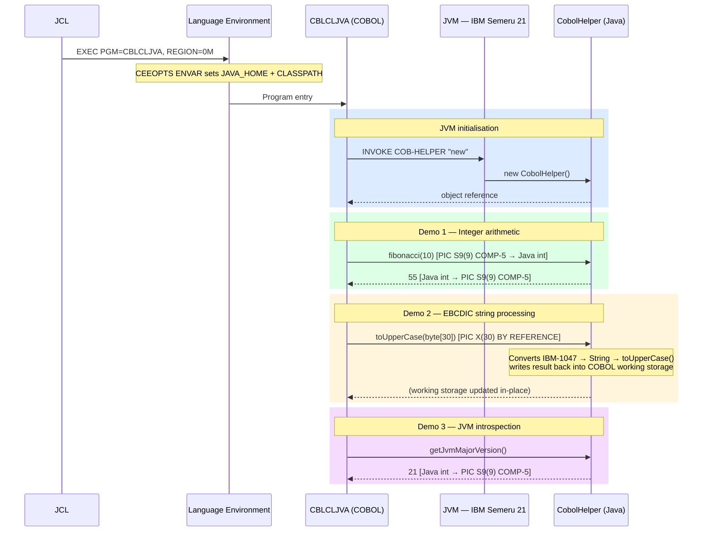

# COBOL for z/OS

Enterprise COBOL codebase for IBM z/OS demonstrating a range of techniques including DB2 SQL, IBM MQ, file processing, string handling, date/time processing, system introspection, and COBOL–Java interoperability. Built with DBB (Dependency Based Build) and tested with zUnit.

## Repository Structure

```
├── SOURCE/           - COBOL program source files
├── COPYLIB/          - Shared copybooks (data structures, linkage sections)
├── JAVA/             - Java source for COBOL-Java interoperability demo
├── JCL/              - Compile and execution JCL for project programs
├── SQL/              - SQL DDL and standalone scripts
├── application-conf/ - DBB build and compiler configuration
├── Z-GIT/            - zGit metadata (#MAKE, #IGNORE)
└── zGIT-DS-Attributes - z/OS dataset allocation attributes
```

## Programs

| Program    | Description |
|------------|-------------|
| HELLOW     | Date and time formatting example |
| WHOAMI     | Retrieves job name, step, program name, and user ID via z/OS PSA/TCB structures |
| DB2ARCH    | DB2 archive table operations with embedded SQL |
| ORGREP     | Organisation table reporting (queries Q.ORG via DB2) |
| CSQ4BVJ1   | IBM MQ — get messages from a queue |
| CSQ4BVK1   | IBM MQ — put messages to a queue |
| TOURFILE   | Sequential file processing with zUnit test coverage |
| CHKCODE    | Tour code validation (callable subprogram) |
| CHARFUNC   | Intrinsic functions: LENGTH, MAX, MIN, UPPER-CASE, LOWER-CASE, REVERSE, NUMVAL |
| INSPECT1   | INSPECT statement — TALLYING and REPLACING |
| STRING1    | STRING statement — building output records |
| STRING2    | STRING statement — formatting with delimiters |
| UNSTRNG    | UNSTRING statement — parsing delimited data |
| INTRDATE   | CURRENT-DATE, DAY-OF-WEEK, and integer date conversion |
| NUMVAL     | NUMVAL-C and FUNCTION MAX with numeric strings |
| AMTOOLS    | Dynamic CALL to AMRANDOM and AMDELAY utilities |
| CBLCLJVA   | COBOL calling Java via OO INVOKE — integer, string, and JVM introspection demos |

## COBOL–Java Interoperability

`CBLCLJVA` demonstrates Enterprise COBOL 6.5 calling a Java class directly using the built-in OO `INVOKE` mechanism. COBOL and Java run in the **same address space** — no middleware, no dataset exchange. Language Environment initialises an IBM Semeru 21 JVM on the first `INVOKE` call, with `JAVA_HOME` and `CLASSPATH` passed via `CEEOPTS ENVAR` in the JCL.

### Runtime Architecture



### Data Type Mapping

| COBOL | Java | Passing convention |
|---|---|---|
| `PIC S9(9) COMP-5` | `int` | `BY VALUE` |
| `PIC S9(18) COMP-5` | `long` | `BY VALUE` |
| `COMP-2` | `double` | `BY VALUE` |
| `PIC X(n)` | `byte[]` — raw EBCDIC | `BY REFERENCE` — Java writes back to COBOL storage |
| `OBJECT REFERENCE` | Java object | `BY VALUE` |

### Key Compiler Option

| Option | Purpose |
|---|---|
| `THREAD` | Enables OO `INVOKE`, `REPOSITORY` paragraph, and LE JVM initialisation |
| `RENT` | Required for Language Environment thread-safety (already default) |

See [COBOL-JAVA-INTEROP.md](COBOL-JAVA-INTEROP.md) for the full implementation guide including USS build steps, JCL, and troubleshooting.

## Coding Standard

Every program contains the following identification and environment header:

```cobol
       IDENTIFICATION DIVISION.
       PROGRAM-ID. <name>.
       AUTHOR. BENJAMIN THOMPSON.
       DATE-WRITTEN. 2024-07-08.
       DATE-COMPILED.

       ENVIRONMENT DIVISION.
       CONFIGURATION SECTION.
       SOURCE-COMPUTER. Z32A.
       OBJECT-COMPUTER. Z32A.
```

## Requirements

- IBM z/OS
- Enterprise COBOL v6
- Git for z/OS
- DBB (Dependency Based Build) toolkit
- DB2 for z/OS (for DB2ARCH, ORGREP)
- IBM MQ for z/OS (for CSQ4BVJ1, CSQ4BVK1)
- IBM Semeru Runtime 21 + JZOS 4.0 (for CBLCLJVA)

## Build

Builds are driven by DBB using the Groovy scripts referenced in `application-conf/`. The build order and compiler options are defined in `application-conf/application.properties` and `application-conf/Cobol.properties`. zUnit tests run automatically when `runzTests=True` is set.

## Clone

```
git clone https://github.com/benjaminthompson1/COBOL.git
```
